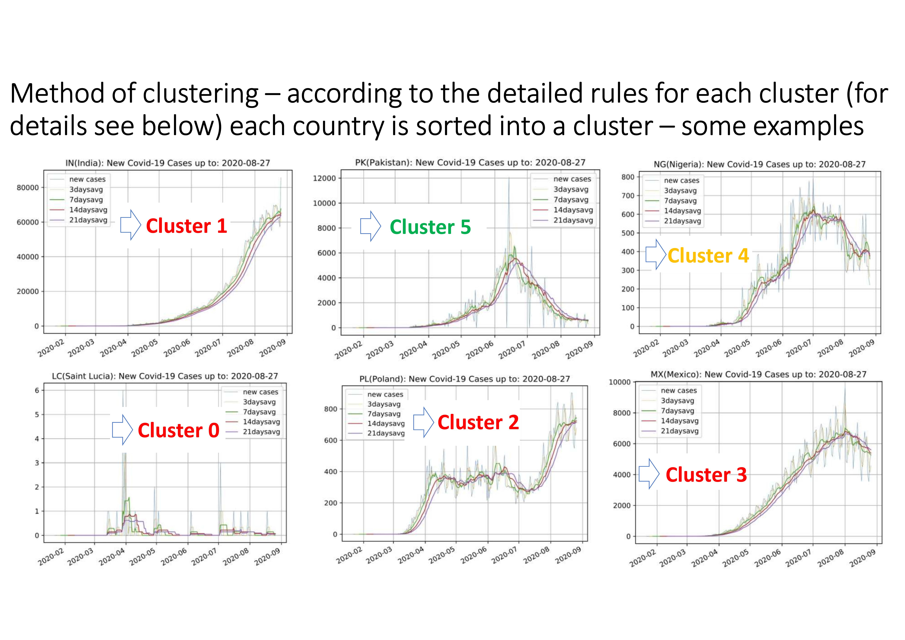

empirical_eyes

# Publishing a data science projects

### I – ANALYZING THE COVID 19 INFECTION DEVELOPMENT

#### 1 - Starting point - to have a (data science) question. 

In my case - at the beginning of the covid crisis - I was very much interested in having an overview on the status of covid19 infections in the various countries at each point in time. Working in the airline industry I was particularly interested in so-called online countries, i.e. countries which had formerly, i.e. before the covid19 breakout, been online connected by the airline under consideration. Idea was to early identify those countries which had covid19 "under control", because these would be the first countries, where airline travel demand would pick up again. 

My goal was not to rely on any third-party reports which I could not modify or update according to my interests and needs (e.g. which countries are displayed, which figures are shown, which time comparison is displayed etc.) but to build up an analysis/report which reflected my approach of describing the current covid situation. The basic idea was to somehow scan the typical (i.e. "bell shaped") covid curve of new infections for each and every country and then to position each country on such a "typical generic bell shaped covid curve" in order to get an overview on one page. 

The basic idea is sketched on following two slides: 



#### 2 - Data science software

Apart from the (data science) question you obviously have to have access to a data science software that provides the required functionalities you need in order to collect, modify/manipulate and finally analyse and display the data and results.

Having worked in data science over many years I have gained some experience in data science, econometrics and statistics related software such as GAUSS, SAS, SPSS, LIMDEP, R, etc. as well as data handling related/programing languages, e.g. SQL, PHP, Perl, etc.. Python however I had not touched so far and hence looking into some statistics on data science software usage showed me that the usage of Python was substantially increasing over the last years. Hence, I wanted to get an understanding of Python and decided to use Python for this project.

How to install Python in which version and with which modules? There are various tutorials and videos in the internet available which provide a very good description on how to install Python. My first approach was to install python directly from the [python page](https://www.python.org/downloads/windows/) which worked out very smooth. However later on, when I was interested in having an environment which also contains additional to Python respective programming editors and IDEs as well as potential interfaces to other data science software such as R, etc.. For that purpose the distribution manager [Anaconda](https://en.wikipedia.org/wiki/Anaconda_(Python_distribution)) is suited very well. As package manager I used [pip](https://de.wikipedia.org/wiki/Pip_(Python)), but there is also as alternative [conda](https://en.wikipedia.org/wiki/Conda_(package_manager)) - for differences between both package managers see e.g. following [Link](https://www.anaconda.com/blog/understanding-conda-and-pip). 

After having installed Anaconda you have a set of programming editors and IDEs (e.g. Jupyter Notebook, JupytherLab, Spyder, PyCharm, etc.) at hand. For a nice overview and comparison of such Python IDEs and code editors see under following [Link](https://www.datacamp.com/community/tutorials). I have started of with JupytherLab and later additionally also used Spyder.

#### 3 - Data analysis

In the following I will describe the various steps of the data analysis which have been conducted including the corresponding python script. If you would like to see the full final python scripts please look here:

- [Data_Preparation_(01__run_covid_sv_1.py)](01_run_covid_sv_1.py)
- [Web_Application_(02_web_covid_sv_1.py)](02_web_covid_sv_1.py)

The first script is focussing on preprocessing the data and doing the necessary calculations for the analysis. After this has been done the preprocessed data is than being stored in some Excel files. The second script reads/opens this preprocessed data and than focuses in particular on displaying the results to the enduser. 

I will start of with explaining the first script. Every data analysis starts of with finding/getting an appropriate data source to be analyzed. In my case basically in a first step a Google search directed me to the GitHub Data Source: D2019 Novel Coronavirus COVID-19 (2019-nCoV) Data Repository by Johns Hopkins CSSE. 

In order to extract this data from the John Hopkins University GitHub Data Repository and to further work with it in Python it is very useful to install the package pandas, which is a very powerful Python data analysis library. Additionally to pandas there are further packages such as numpy, DateTime, matplotlib etc. within Python which will be very helpuful for the further analysis.  

The installation of such packages (e.g. pandas, numpy, etc.) is done very easily via the package manager pip using the following commands: 

```
- pip install pandas
- pip install numpy
- pip install Datetime
- ...
``` 
Once such different Python packages (e.g. pandas, numpy, etc.) have beeen installed, you can easily import them right at the beginning of your programm
```
# (0) Import various packages 
import pandas as pd
import numpy as np
import datetime
from datetime import date, datetime, timedelta
import requests
import matplotlib.pyplot as plt
from matplotlib.backends.backend_pdf import PdfPages
import matplotlib.dates as mdates
from pandas.plotting import register_matplotlib_converters
register_matplotlib_converters()
import sqlite3
import pandasql
from pandasql import sqldf
```
After the packages have been imported you are ready to start processing the data. Following command will extract you the respective COVID19 data (in my case only the confirmed Covid19 cases) into a pandas dataframe:
```
# (1) get covid data from JHU and cleanse some Country Names
url = 'https://raw.githubusercontent.com/CSSEGISandData/COVID-19/master/csse_covid_19_data/csse_covid_19_time_series/time_series_covid19_confirmed_global.csv'
confirmed = pd.read_csv(url, error_bad_lines=False)
print(confirmed)
```
Given that the data is provided in some cases on country and in other cases on state level and I only intend to do the analysis on country level an aggregation of the infection figures to the country level need to be done:
```
# (2) aggregate to country
confirmed_cn = confirmed.groupby('Country/Region', as_index=False).agg({np.sum})
confirmed_cn.columns = confirmed_cn.columns.droplevel(1)
confirmed_cn = confirmed_cn.reset_index()
confirmed_cn = confirmed_cn.drop(columns=['Lat', 'Long'])
```
After this various caluculations are being conducted. For example based on the available cumulative infections the value of daily new infections needs to be derived. Addionally  for the purpose of getting a better view on the development of new infections it make sense to calculate moving averages for different time periods (e.g. 7 days, 14 days, etc.). Also this section aims to calculate for each country the cluster affiliation on the typical bell shaped curve of new infections. Looking at such a curve I somehow started of with *visually* defining 6 clusters as follows:

- Cluster 0: Current cumulative Covid19 infections are still very low
- Cluster 1: Increasing new daily Covid19 infections
- Cluster 2: Potentialy reaching the peak of new daily Covid19 infections
- Cluster 3: Indication of decreasing new daily Covid19 infections
- Cluster 4: Decreased number of new daily Covid19 infections (compared to historical peak)
- Cluster 5: Low number of new daily Covid19 infections (compared to historical peak)

Obviously one needs to translate these visual cluster definition into some *operational* rules which can be applied to any data set of historical and current numbers of new covid infections for each country at hand. The *operational* rules I have used are as follows:

- Cluster 0: Current cumulative Covid19 infections are still very low
  - Current cumulative Covid19 infections are < 1.000 cases
- Cluster 1: Increasing new daily Covid19 infections
  - Avg 7 days level > 70% of max avg 7 days level so far
  - Avg 7 days level > Avg 14 days level
  - Avg 7 days level increases
- Cluster 2: Potentialy reaching the peak of new daily Covid19 infections
  - Avg 7 days level > 70% of max avg 7 days level so far
  - Avg 7 days level > Avg 14 days level
  - Avg 7 days level decreases
- Cluster 3: Indication of decreasing new daily Covid19 infections
  - Avg 7 days level > 70% of max avg 7 days level so far
  - Avg 7 days level < Avg 14 days level
- Cluster 4: Decreased number of new daily Covid19 infections (compared to historical peak)
  - Avg 7 days level between 30% and 70% of max avg 7 days level so far
- Cluster 5: Low number of new daily Covid19 infections (compared to historical peak)
  - Avg 7 days level < 30% max avg 7 days level so far

If you look at the coding below you will see that there are various steps in between necessary in order to get to these final cluster affiliations. Moreover apart from calculating the current cluster affiliation my goal is also to later on display the development/dynamic of cluster affiliation, i.e. to show if a country has remained within the cluster or shifted one cluster up or down since the last snap shot. 
 
```
# (3) Do various calculations (e.g. transpose data, calculate new infections and moving averages, etc. )
# transpose datum from attribute name to columne
confirmed_cntp = confirmed_cn.melt(id_vars=["Country/Region"])
confirmed_cntp = confirmed_cntp.rename(columns={"variable": "datum", "value": "confi"})
confirmed_cntp["datum"] = confirmed_cntp["datum"].astype('datetime64[ns]')
confirmed_cntp = confirmed_cntp.sort_values(by=["Country/Region", "datum"])
confirmed_cntp = confirmed_cntp.reset_index()
confirmed_cntp = confirmed_cntp.drop(columns=['index'])

#calculate new infections: new, newpct, newgr, newgrlg
confirmed_cntp['confi_new'] = confirmed_cntp.groupby(['Country/Region'])['confi'].diff()#.fillna(0)
confirmed_cntp['confi_new'] = confirmed_cntp['confi_new'].fillna(confirmed_cntp['confi'])
confirmed_cntp['confi_err'] = np.where(confirmed_cntp['confi_new'] < 0, 1, 0)
confirmed_cntp.loc[confirmed_cntp.confi_err == 1, 'confi_new'] = 0

#calculate 
  # moving average of nf for (a) 3 days (b) 7 days (c) day 8 to 14
  # moving average of nf gr for (a) 3 days (b) 7 days (c) day 8 to 14

confirmed_cntp['ma3d'] = confirmed_cntp.groupby(['Country/Region'])['confi_new'].rolling(3).mean().reset_index(0,drop=True)
confirmed_cntp['ma7d'] = confirmed_cntp.groupby(['Country/Region'])['confi_new'].rolling(7).mean().reset_index(0,drop=True)
confirmed_cntp['ma7dp1'] = confirmed_cntp.ma7d.shift(1)
confirmed_cntp['ma7dp7'] = confirmed_cntp.ma7d.shift(7)
confirmed_cntp['ma14d'] = confirmed_cntp.groupby(['Country/Region'])['confi_new'].rolling(14).mean().reset_index(0,drop=True)
confirmed_cntp['ma21d'] = confirmed_cntp.groupby(['Country/Region'])['confi_new'].rolling(21).mean().reset_index(0,drop=True)

confirmed_cntp['ma7dmax'] = confirmed_cntp.groupby('Country/Region')['ma7d'].transform('max')
confirmed_cntp['ma14dmax'] = confirmed_cntp.groupby('Country/Region')['ma14d'].transform('max')
confirmed_cntp['ma7dmaxc'] = confirmed_cntp.groupby('Country/Region').ma7d.cummax()
confirmed_cntp['ma14dmaxc'] = confirmed_cntp.groupby('Country/Region').ma14d.cummax()

confirmed_cntp['ma7dlvlc'] = confirmed_cntp['ma7d'] / confirmed_cntp['ma7dmaxc']
confirmed_cntp.loc[confirmed_cntp['ma7dlvlc'] >= 0.7, 'levelcma7d'] = 'high'
confirmed_cntp.loc[(confirmed_cntp['ma7dlvlc'] > 0.3) & (confirmed_cntp['ma7dlvlc'] < 0.7), 'levelcma7d'] = 'mid'
confirmed_cntp.loc[(confirmed_cntp['ma7dlvlc'] <= 0.3) & (confirmed_cntp['ma7dlvlc'] >= 0.1), 'levelcma7d'] = 'low_a'
confirmed_cntp.loc[confirmed_cntp['ma7dlvlc'] < 0.1, 'levelcma7d'] = 'low_b'

confirmed_cntp['ma7dmma7dp1'] = confirmed_cntp['ma7d']-confirmed_cntp['ma7dp1']
confirmed_cntp.loc[confirmed_cntp['ma7dmma7dp1'] > 0, 'kippt'] = 'no'
confirmed_cntp.loc[confirmed_cntp['ma7dmma7dp1'] <= 0, 'kippt'] = 'yes'

confirmed_cntp['ma7dmma14d'] = confirmed_cntp['ma7d']-confirmed_cntp['ma14d']
confirmed_cntp.loc[confirmed_cntp['ma7dmma14d'] > 0, 'goldencross'] = 'no'
confirmed_cntp.loc[confirmed_cntp['ma7dmma14d'] <= 0, 'goldencross'] = 'yes'

confirmed_cntp.loc[(confirmed_cntp['levelcma7d'] == 'high') & (confirmed_cntp['kippt'] == 'no') & (confirmed_cntp['goldencross'] == 'no'), 'cluster'] = 'q1'
confirmed_cntp.loc[(confirmed_cntp['levelcma7d'] == 'high') & (confirmed_cntp['kippt'] == 'yes') & (confirmed_cntp['goldencross'] == 'no'), 'cluster'] = 'q2'
confirmed_cntp.loc[(confirmed_cntp['levelcma7d'] == 'high') & (confirmed_cntp['goldencross'] == 'yes'), 'cluster'] = 'q3'
confirmed_cntp.loc[(confirmed_cntp['levelcma7d'] == 'mid'), 'cluster'] = 'q4'
confirmed_cntp.loc[(confirmed_cntp['levelcma7d'] == 'low_a'), 'cluster'] = 'q5'
confirmed_cntp.loc[(confirmed_cntp['levelcma7d'] == 'low_b'), 'cluster'] = 'q5'

confirmed_cntp.loc[(confirmed_cntp['confi'] < 1000), 'cluster'] = 'q0'
confirmed_cntp.loc[(confirmed_cntp['confi'] >= 1000), 'cluster'] = confirmed_cntp.cluster

confirmed_cntp['clusterp1'] = confirmed_cntp.cluster.shift(1) 
confirmed_cntp.loc[(confirmed_cntp['cluster'] > confirmed_cntp['clusterp1']), 'clusterdev'] = 1
confirmed_cntp.loc[(confirmed_cntp['cluster'] == confirmed_cntp['clusterp1']), 'clusterdev'] = 0
confirmed_cntp.loc[(confirmed_cntp['cluster'] < confirmed_cntp['clusterp1']), 'clusterdev'] = -1

confirmed_cntp['clusterp7'] = confirmed_cntp.cluster.shift(7) 
```

In a next step I am joining/merging to the data frame above (which contains e.g. the calucation of cluster for each country) a futher data set which contains for each country some additional core information such as population or two letter country abreviations. This core data set has been pre-processed and stored as an Excel file (confirmed_ctrystamm.xlsx). Here in this program this Excel file is just being imported into a pandas data frame for further processing.

```
# (4) Merge Calculatin data set with Stammdaten and calculate further attributes

confirmed_cntrystamm = pd.read_excel(locpath0+"confirmed_ctrystamm.xlsx", keep_default_na=False,error_bad_lines=False)
confirmed_cntpfull = pd.merge(left=confirmed_cntp, right=confirmed_cntrystamm, how='left', left_on='Country/Region', right_on='Cntry_NM')

confirmed_cntpfull['incident'] = confirmed_cntpfull['confi_new']/confirmed_cntpfull['population']*100000
confirmed_cntpfull['incident7d'] = confirmed_cntpfull['ma7d']/confirmed_cntpfull['population']*100000
confirmed_cntpfull['incident7dp7'] = confirmed_cntpfull.incident7d.shift(7)

confirmed_cntpfull['confi_estshpop'] = confirmed_cntpfull['confi']*10/confirmed_cntpfull['population']
confirmed_cntpfull['daysdouble'] = confirmed_cntpfull.confi.shift(7)/confirmed_cntpfull.ma7d
```

When I was confronted with the situation that I needed some further information such as population and country abreviation for each country I somehow thought at the beginning that I would need to manually collect the data for the ~200 countries from the internet and put it into an Excel sheet. But luckily also here Python offers and API to query a SPARQL endpoint. Following code extracts the relevant information and stores it into an Excel file.

```
# Excurse - Get core data for each country from Wikidata via SPARQL 
import pandas as pd
import numpy as np
import requests

url = 'https://query.wikidata.org/sparql'
query = """
    SELECT ?country ?Cntry_CD ?countryLabel ?population 
      WHERE 
      {
       ?country wdt:P463 wd:Q1065.
       ?country wdt:P297 ?Cntry_CD.
       ?country wdt:P1082 ?population.
       SERVICE wikibase:label { bd:serviceParam wikibase:language "en". }
      }
"""
r = requests.get(url, params = {'format': 'json', 'query': query})
data = r.json()

from collections import OrderedDict

countries = []
for item in data['results']['bindings']:
    countries.append(OrderedDict({
        'country': item['countryLabel']['value'],
        'Cntry_CD': item['Cntry_CD']['value'],
        'population': item['population']['value'],
    }))

population = pd.DataFrame(countries)
population = population.astype({'population': float})
population = population.rename(columns={'country': 'Cntry_NMPOP'})
# Eliminierung von potentiellen Doppeleinträgen 
population.groupby(['Cntry_NMPOP', 'Cntry_CD'], sort=False)['population'].max()
population.sort_values(by='population', ascending=False)
population.reset_index(drop=True)
print(population)

population.to_excel("Population_input.xlsx", sheet_name='Tabelle1') 
```

xxx 

#### 4 - From local to cloud
