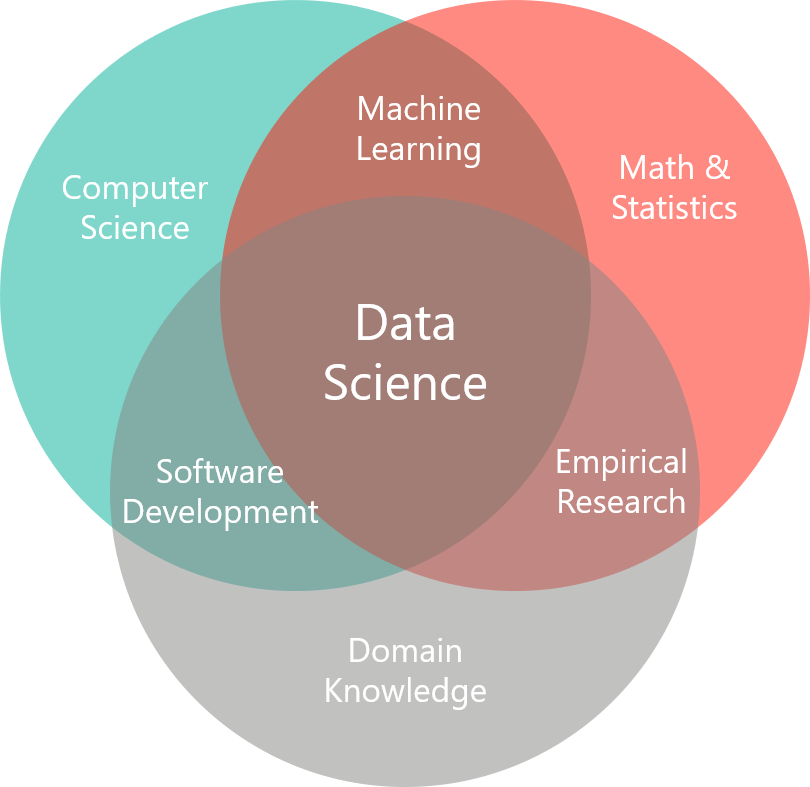
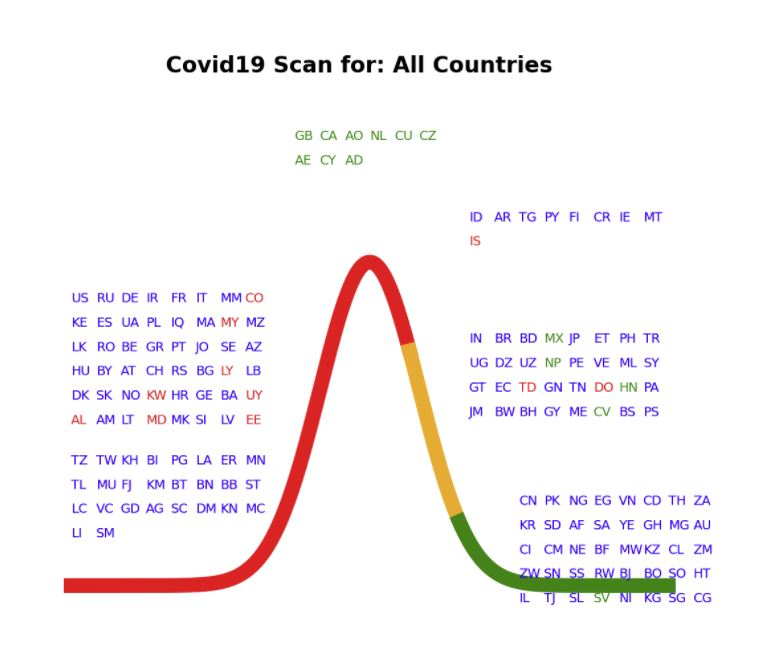
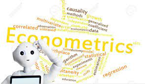
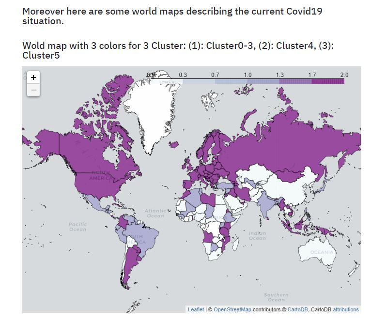

## empirical_eyes

In this repository I aim to publish some privately conducted data science projects/exercises. The documentation of these projects is ongoing. As soon as a prototype of any project is ready it will be published. Please note that while the documentations of each project is basically always available I have to excuse for the fact that the corresponding application is sometimes not accessible due to the fact that it is hosted on a cloud server which sometimes has a downtime. Following projects exist so far.

### 1 - Publishing a data science project (Covid19_Scan)
I started of with the document [Publishing a data science project (Covid19_Scan)](https://github.com/MWelHeb/01_Covid19_Scan/blob/main/Data_Science_Projects.md) which is a description of a first project related to an exemplary analysis of Covid19 figures. The document aims to stretch the full picture from the starting point of a data science project, i.e. from choosing an appropriate data science software, followed by the data analysis itself which involves data preparation but also presenting the analysis and results through a web application, and finally the topic of making this analysis available to a large audience (potentially anybody world wide) by means of passing the analysis from a local client/computer to a cloud environment.

- [Documentation: Publishing a data science project (Covid19_Scan)](https://github.com/MWelHeb/01_Covid19_Scan/blob/main/Data_Science_Projects.md) 
- [Application: Covid19 Scan - currently not working due to missing free tier cloud](http://18.192.208.203:8501/)

### 2 - Analyzing ETF with Python
Next data science area which I was interested in related to the topic of finance. When it comes to investing money many advices center around investments into ETF (i.e. exchange traded funds vs. e.g. single stocks). Therefore, I wanted to get a better understanding on the variety of ETF and their historical developments and any potentially relevant insights which might help when investing into ETF.

- [Documentation: Analyzing ETF with Python](https://github.com/MWelHeb/02_ETF_Analysis/blob/main/ETF_Analysis.md) 
- [Application: ETF Analysis - currently not working due to missing free tier cloud](http://18.192.208.203:8502/)

### 3 - Algorithmic trading with Python
Algorithmic trading, i.e. trading based on algorithms or rules (which are developed based on some trading strategy), refers to computerized, automated trading of financial instruments like stocks with little or no human intervention during trading hours. Nowadays in the U.S. stock market and many other developed financial markets, about 70-80 percent of overall trading volume is generated through algorithmic trading. Obviously, these figures are impressive and hence the topic caught my attention and I thought that it could be a nice use case of applying and practicing Python as well quantitative methods.

- [Documentation: Algorithmic trading with Python](https://github.com/MWelHeb/03_Algo_Trading/blob/main/Algorithmic_Trading_with_Python.md) 

### 4 - Descriptive Statistics

During the last several years I have written - among others - a script for a three days course focusing on descriptive statistics combined with some "hands on" exercises and use cases. Given that statistical concepts are also one key component of many Python data science projects I thought it would be reasonable to provide the script for download here.

- [Documentation: Descriptive Statistics - 3 Days Course](https://github.com/MWelHeb/04_Descriptive_Statistics/blob/main/Descriptive_Statistics_3days_course.md) 

### 5 - Analyzing survival probability on the Titanic

When you search internet for data science competitions the first thing you find is Kaggle. Kaggle, founded in 2010, is an online community of data scientists and machine learning practitioners which offers among others machine learning competitions. Since 2017 Kaggle is a subsidiary of Google. A very nice way to get familiar with the Kaggle platform and to dive into ML competitions is to start with the legendary Titanic ML competition. Below you find my first approach with regards to the Titanic ML competition.

- [Documentation: Titanic ML competition](https://github.com/MWelHeb/03_Algo_Trading/blob/main/Algorithmic_Trading_with_Python.md) 
